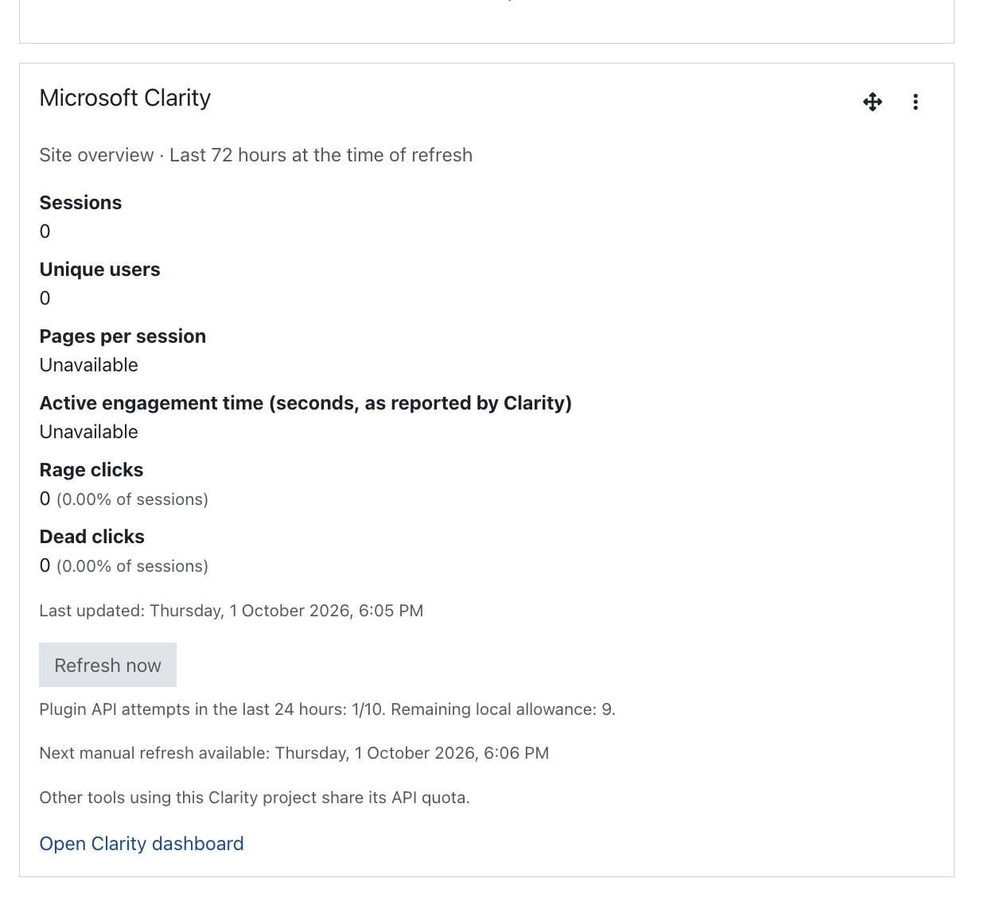

# Microsoft Clarity for Moodle



One **block plugin** for Moodle 4.5 and newer. It provides site-wide Clarity tracking,
admin-only course and user links, and an optional admin dashboard overview.
Tracking and navigation work on pages with **no block instance**.

## Install

1. Upload `dist/block_msclarity-1.0.1.zip` through **Site administration → Plugins → Install plugins**,
   or copy this repository into `blocks/msclarity` (`public/blocks/msclarity` on Moodle 5.1+).
   The plugin component is `block_msclarity`, despite this workspace's original directory name.
2. Complete Moodle's plugin installation through **Site administration → Notifications**.
3. Remove the old Clarity snippet from **Appearance → Additional HTML** before entering the project ID.
4. Open **Plugins → Blocks → Microsoft Clarity** and enter the two settings:
   - **Project ID**: from Clarity **Settings → Overview**; for the existing project, `w3y4plwlqv`.
   - **API token**: generate in that same project's **Settings → Data Export**. This enables reporting.
5. As a site admin, open your dashboard, enable edit mode, and add **Microsoft Clarity**.
   You can also add it to **Appearance → Default Dashboard page**. It remains invisible to non-admins
   when their dashboards inherit it; existing dashboards follow Moodle's normal reset behavior.

There are exactly two plugin settings and no per-instance configuration. A blank project ID disables tracking
and contextual links. A blank API token disables reporting while tracking continues. Disabling the plugin
in **Manage blocks** stops tracking, links, and reporting. Removing a dashboard instance only removes that display.

## Tracking

The plugin loads Clarity asynchronously for browser HTML pages, including logged-out and guest pages.
On every authenticated non-guest page it calls `clarity("identify", "<Moodle username>")` and sends
`MoodleUserID`, `Username`, and `Email` tags using the current Moodle visitor. It uses neither `MoodleContextBridge`
nor browser globals such as `M.cfg.userId`.

Context tags are fixed:

| Tag | Value |
| --- | --- |
| `MoodleUserID` | Current authenticated visitor's numeric Moodle user ID |
| `Username` | Current authenticated visitor's Moodle username |
| `Email` | Current authenticated visitor's Moodle email address |
| `MoodleCourseID` | Course ID, including activity pages within that course |
| `MoodleCourseModuleID` | Activity's `course_modules.id`, rather than its module instance ID |
| `MoodleModuleType` | Activity type, such as `page`, `quiz`, or `assign` |
| `MoodleCourseCategoryID` | Course category ID |
| `MoodleContextID` | Current page context ID |
| `MoodlePageType` | Moodle page type, such as `course-view-topics` |

Unavailable tags are omitted, and the site course is excluded from course tags. Guests are never identified
as one shared Moodle user. The visitor remains the tracked user when they view another person's profile.

Microsoft hashes the Identify API's username identifier. The separate `MoodleUserID`, `Username`, and `Email`
custom tags are readable values. Use the custom user-ID filter for a username, or the `Email` tag to filter by email.
The existing numeric `MoodleUserID` filters remain available for profile links and historical sessions.
Sessions collected under the previous numeric Identify ID will not automatically merge with the new username identifier;
a Moodle username change also changes that identifier. The plugin declares the transmitted data through
Moodle's Privacy API and stores no individual user analytics in Moodle. Clarity's own collection follows the
project's masking and consent behavior; this plugin does not send a command granting consent.

## Admin-only access and links

The capabilities `block/msclarity:view`, `block/msclarity:addinstance`, and `block/msclarity:myaddinstance`
have **no default role grants** and do not clone another capability. Moodle site admins have their normal
capability bypass. Explicit site-admin checks prevent managers or any other non-admins from viewing reports,
seeing links, adding, or editing the block, even if they are deliberately granted these capabilities.
The plugin settings page is also restricted to site admins.

- **Course → More → View course in Clarity** filters `MoodleCourseID:<course ID>`.
- **User profile → Reports → View user in Clarity** filters `MoodleUserID:<profile user ID>`.
- The dashboard block opens the unfiltered project dashboard.

Links use the configured project and **Last 3 days**, with safely encoded `Variables` parameters matching
the existing user-link convention. Course and user links open in a new tab with `noopener noreferrer`.
Course filters include sessions carrying that course tag, including activity
visits, rather than only the course landing URL. Clarity filters operate on sessions: a matching session can
also contain visits to other courses. Historical sessions recorded before installation will lack the new tags.

Dashboard URL filter parameters are not a documented contract in the API pages below. Verify the resulting
filter in your signed-in Clarity project; the plugin cannot grant access to a Clarity account or project.

## Overview and cron

The block shows site-wide sessions, unique users, pages per session, active engagement time as reported
by Clarity, rage clicks, and dead clicks. Click-session percentages are shown when supplied. Missing fields
are shown as **Unavailable**, not zero; metric values are not estimated from other fields or dimension rows.

Moodle cron runs `\block_msclarity\task\refresh_insights` at minute 17 every six hours. It makes one server-side
request to:

```text
GET https://www.clarity.ms/export-data/api/v1/project-live-insights?numOfDays=3
Authorization: Bearer <API token>
```

The last 72 hours are relative to the successful refresh, not the dashboard visit. The block shows the refresh
timestamp in the viewer's timezone. Opening or reloading the dashboard does not trigger an API call.

The admin-only **Refresh now** button immediately runs the same task's refresh operation. It uses a POST request
with Moodle's session key and returns to the dashboard with the result. The button displays this plugin's attempt
count, states that Clarity's remaining project quota is unknown, and shows the next available refresh time.
It is disabled during a cooldown, exhausted local allowance,
or upstream rate-limit pause. Manual refreshes have a one-minute cooldown and can run before the next scheduled refresh.

Clarity limits the API to **10 requests per project per day**, data from the last 1–3 days, and 1,000 rows without
pagination. This plugin requests aggregates without dimensions and normally uses four calls daily. Other tools
using the same project share its quota. A persistent per-project ledger allows **at most 10 attempts in any rolling
24 hours**, shared by scheduled, CLI, and button-triggered refreshes. Failed requests count too. The rolling window
avoids assuming an undocumented daily reset timezone. A lock prevents concurrent requests, and the ledger is read
fresh from the database after acquiring it so stale caches cannot permit extra requests. Scheduled runs still wait
six hours after the most recent attempt; button refreshes use the shorter cooldown. A rate-limit response pauses
all refreshes for that project for 24 hours, even if the local count is below ten.

A live export response inspected on 1 October 2026 returned HTTP 200 without quota-limit, remaining-count,
reset-time, or Retry-After headers. Microsoft's documentation does not specify quota headers or the daily reset
boundary. The local ledger is a safety cap, not a measurement of Clarity's remaining project quota; it cannot
account for requests from other integrations or installations.

The plugin stores only the latest aggregate snapshot and refresh metadata. A failed refresh retains the last
successful snapshot, shows a stale-data notice and a safe error message, and never stores the response body.
Changing the API token invalidates the snapshot without resetting its project ledger or rate-limit pause. Switching
projects uses a separate ledger; switching back retains the earlier project's usage. Upgrading from 1.0.0 preserves
the known backoff and conservatively reserves four legacy request slots until 24 hours after the last old attempt,
because that version recorded only its last attempt and could run once every six hours. The token is masked in Moodle's
settings audit log and is not included in tracking payloads, links, task output, block output, or external block configuration.
It is stored using Moodle's standard server-side plugin configuration storage.

For an initial refresh, click **Refresh now**, or run the task through Moodle's **Scheduled tasks** administration page or CLI:

```sh
# From the Moodle root, on all supported versions:
php admin/cli/scheduled_task.php --execute='\block_msclarity\task\refresh_insights'
```

The export API does not offer course-ID or user-ID filtering. The overview is site-wide; contextual navigation
opens the corresponding filtered dashboard in Clarity.

## Build and checks

Build an installable ZIP using Python's standard library:

```sh
python3 tools/package.py
```

The ZIP contains one `msclarity/` plugin directory and excludes development tests and packaging tools.

Run the portable regression tests:

```sh
php tests/metrics.php
node --test tests/tracking.test.cjs
```

Integration tests create users, a course, activity, settings, and a dashboard block. Run them **only in a disposable
Moodle installation** with this plugin installed:

```sh
php /path/to/msclarity/tests/integration.php /path/to/test-moodle/config.php
```

For rendered-page checks, serve the disposable site using PHP's development server on localhost. Use the root
as document root for Moodle 4.5/5.0, or its `public` directory for Moodle 5.1+. Set the test configuration's
`$CFG->wwwroot` to the corresponding URL, then run:

```sh
php tests/http.php http://localhost:8197 /path/to/test-moodledata/msclarity-test-fixture.json
```

All PHP test entrypoints reject web execution. Tests mock Clarity reports; they make no requests to Clarity.
Installation, integration, and rendered-page checks passed on Moodle **4.5 and 5.2.2** with Boost. Live Clarity
reporting and the signed-in destination filter require the project's credentials for final verification.

## References

- [Clarity Data Export API](https://learn.microsoft.com/en-us/clarity/setup-and-installation/clarity-data-export-api)
- [Clarity Identify API](https://learn.microsoft.com/en-us/clarity/setup-and-installation/identify-api)
- [Clarity custom tags](https://learn.microsoft.com/en-us/clarity/filters/custom-tags)
- [Moodle block plugins](https://moodledev.io/docs/4.5/apis/plugintypes/blocks)

Licensed under the GNU GPL v3 or later; see `COPYING.txt`.
